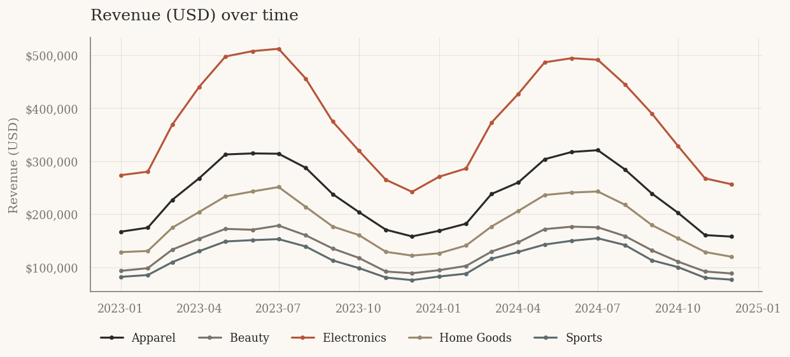
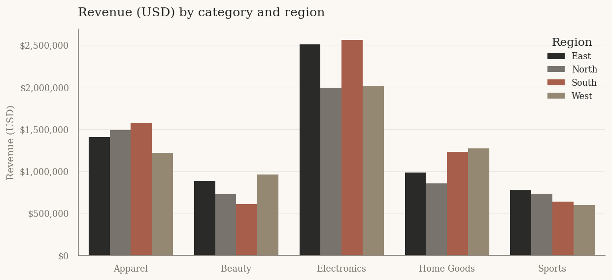
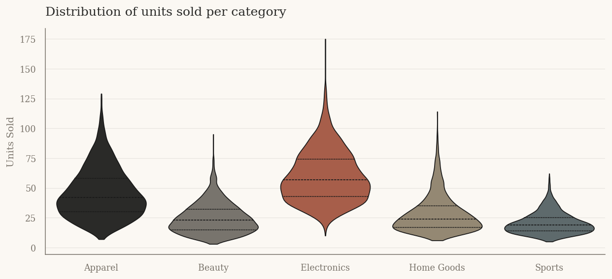
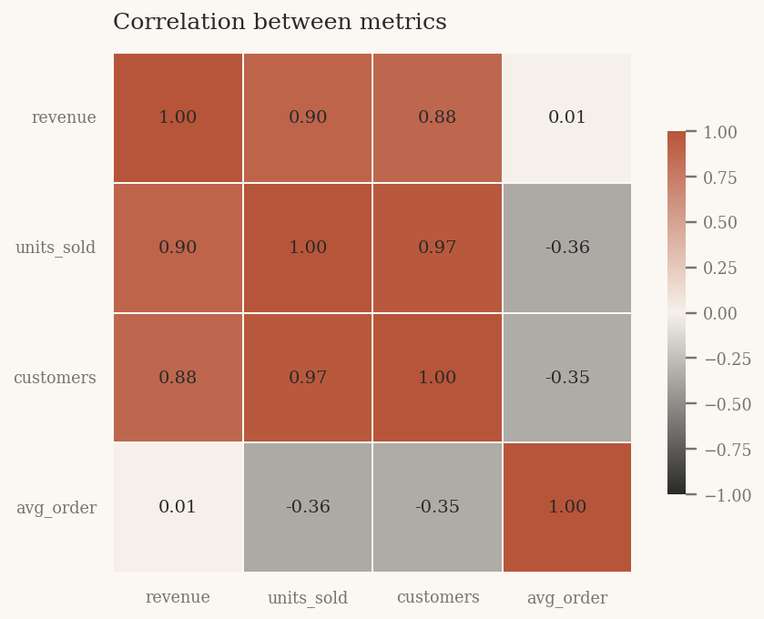

# Sales & Customer Dashboard

An interactive single-page data visualisation dashboard built with **Streamlit**, **Pandas**, **Matplotlib** and **Seaborn**. Two years of synthetic sales data across five product categories and four regions are explored through four complementary chart types and a sidebar of live filters.

---

## Project goals

This project demonstrates three things:

1. **Data wrangling fluency** , generation, cleaning, resampling, grouping, and derived metrics with Pandas.
2. **Visualisation literacy** , matching chart type to question (trend → line, comparison → grouped bar, structure → heatmap, shape → violin) and styling them as a single visual system.
3. **Interface clarity** , a small, restrained UI that updates instantly without ever feeling crowded.

The aesthetic brief was *clean and editorial*: cream background, charcoal text, a single muted terracotta accent, generous whitespace, serif typography. Restraint is the design.

---

## Screenshots

> Screenshots below were rendered directly from the chart functions in `visualisations.py`. Drop your own application screenshots into `screenshots/` and update the filenames here once you've taken them.

| | |
|---|---|
|  |  |
|  |  |

*Top-left:* monthly trend per category, showing the annual seasonality cycle. *Top-right:* category × region revenue breakdown. *Bottom-left:* per-category distribution of the chosen metric. *Bottom-right:* correlation structure between the four numeric metrics.

---

## Run it

Requires Python 3.10+.

```bash
pip install -r requirements.txt
streamlit run app.py
```

Streamlit opens the dashboard at `http://localhost:8501`.

### Dark mode

Streamlit ships with a built-in theme switcher. Open the menu in the top-right (☰) → **Settings** → **Theme** and pick *Dark*. The default light theme uses the cream/charcoal palette defined in `.streamlit/config.toml`.

---

## Project structure

```
.
├── app.py                  # Streamlit UI: layout, filters, metric cards
├── data_loader.py          # Synthetic dataset generation + cleaning
├── visualisations.py       # All chart functions (Matplotlib + Seaborn)
├── requirements.txt        # Pinned major versions
├── .streamlit/
│   └── config.toml         # Theme , primary colour, fonts, backgrounds
├── screenshots/            # Static images used in this README
├── .gitignore
└── README.md
```

The split is deliberate: `data_loader.py` and `visualisations.py` know nothing about Streamlit, so they can be imported into a Jupyter notebook, a report generator, or unit tests without dragging the UI along.

---

## Technical decisions

**Streamlit over Dash.** Streamlit's caching decorator, native widget set, and minimal boilerplate make it the right tool for a single-page analytical UI. Dash gives more layout control but costs more code per feature, which doesn't pay back here.

**Synthetic data, deterministic seed.** A fixed `numpy` seed (`42`) means anyone cloning the repo sees identical numbers. The generator builds in real structure , annual seasonality, weekly cycles, region-specific multipliers, noise , so the correlation heatmap shows non-trivial relationships and the violin plots have differentiated shapes.

**Matplotlib + Seaborn, not Plotly.** The brief asked for the former, but the choice is also defensible: Matplotlib's static output is faster to render, easier to style consistently, and produces cleaner exports for the README. Seaborn handles the statistical primitives (violin, heatmap) with less code than raw Matplotlib.

**Theme as a module-level side effect.** `visualisations.py` calls `apply_theme()` once at import time. Every chart inherits the same fonts, gridlines, and palette without each function having to repeat boilerplate.

**Pure chart functions.** Every function in `visualisations.py` accepts a pre-filtered DataFrame and returns a `Figure`. They don't read Streamlit state. This makes them trivially testable and lets the same functions render the README screenshots from a one-line script.

**Streamlit's native theme over custom CSS.** Colours, primary accent, and base mode (light/dark) live in `.streamlit/config.toml`. The small inline CSS block in `app.py` only handles things the theme can't reach: metric-card spacing, heading typography, and the title rule. This is what keeps the dark-mode toggle working out of the box.

---

## Interaction model

The sidebar has four controls:

- **Date range slider** , filters by month/year using Streamlit's native datetime slider.
- **Categories** , multi-select (defaults to all five).
- **Regions** , multi-select (defaults to all four).
- **Primary metric** , switches the line, bar, and violin charts between revenue, units sold, customers, and average order value.

The four metric cards at the top (total revenue, average daily revenue, peak day, total units) all recompute on every filter change. If a filter combination produces an empty dataset, the app surfaces a warning and skips chart rendering rather than crashing.

A collapsible *Inspect filtered data* panel at the bottom shows the first 500 rows of the active selection.

---

## Possible extensions

- Replace the synthetic generator with a real CSV loader , only `data_loader.load_data()` needs to change.
- Add a forecast overlay to the time series (statsmodels' `SARIMAX` or Prophet).
- Export the current view to PDF via Matplotlib's multi-page backend.
- Migrate to Dash if multi-page navigation or finer-grained callback control becomes needed.

---

## License

MIT. Use freely for portfolio reference.
